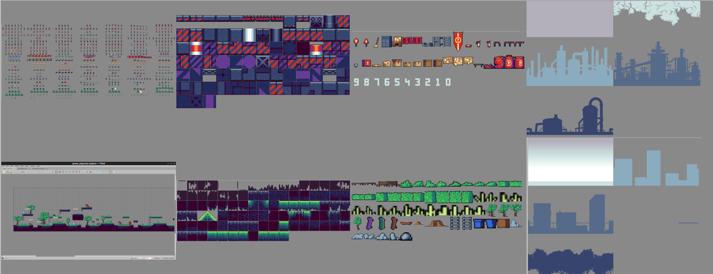

# Cyberpunk 2030
## Current status:
https://user-images.githubusercontent.com/101417927/230668643-49f9d444-d90e-460b-86c0-657507ec31a6.mp4

-------
# 1. Game arhitecture
- ### Main structure
 The project follows the state machine principle(State Design Pattern). The game has multiple scenes, where each scene contains several components such as map , characters, and buttons. Modifying the current active scene can be easily achieved through its associated component or with other scene, without affecting the underlying structure.

- ### In game interations 
Dynamic components that can alter the game's guidelines will interact via the Mediator Design Pattern, providing elegant and well-structured code practices.

# 2. Story  

- ### Introduction
 In a dystopian world ruled by the Illuminati, Blaze takes on the role of a lone fighter with extraordinary abilities. The fighter's mission is to stop the Illuminati from launching a mass destruction rocket that would devastate society.

- ###  Dangers
 To achieve this, Blaze must battle through various enemies, including gangsters, cyber gunners, drones, and robots, all while navigating traps and dangerous terrain. The fighter must also save innocent people caught in the crossfire, making tough decisions along the way.

- ###  Challenges
 To obtain the key codes needed to stop the rocket launch, the fighter must defeat the Illuminati general, a former American football player, and the boss of the Illuminati, a man with a powerful machine. Each of these battles presents a unique challenge, with the boss battle being particularly difficult.

- ### Saving the world
 Once Blaze has collected all the key codes, he must race to the rocket's launch site, battling soldiers who try to stop him. With his fighting skills and determination, Blaze deactivates the rocket just in time, saving society from certain destruction.

- ### Happy end
 As the fighter rides off into the sunset, he knows that his mission was worth the risks. Blaze have proven that even in a world ruled by the Illuminati, there is still hope for a better future.

# 3. Gameplay
- This is a thrilling platformer game that can be played at a fast or medium pace.
- The game features a main player who can be customized as a cyborg, punk, or biker character, and is equipped with body and fire weapons to fight against various enemies. The main player also possesses incredible parkour abilities to navigate through challenging levels filled with traps, dangerous animals, and six types of enemies, each with their unique behaviors.
- As the game progresses, the player must face two boss fights and race against time, which adds an extra layer of excitement to the gameplay. To enhance the player's experience, there are several interactive elements such as citizens who provide helpful information, chests that contain collectable weapons, ladders to climb, barrels that explode, cards to collect, and control panels to operate.

# 4. Game Assets

# 5. User Interactions
